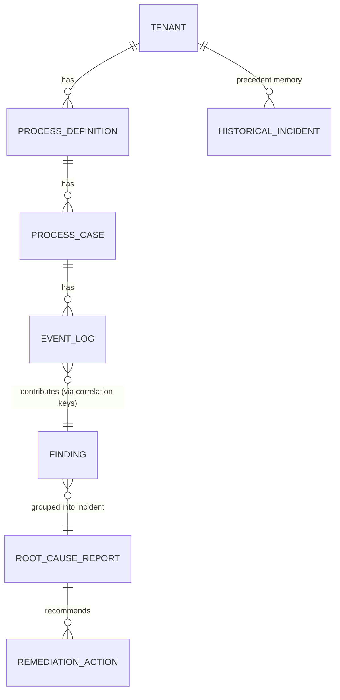
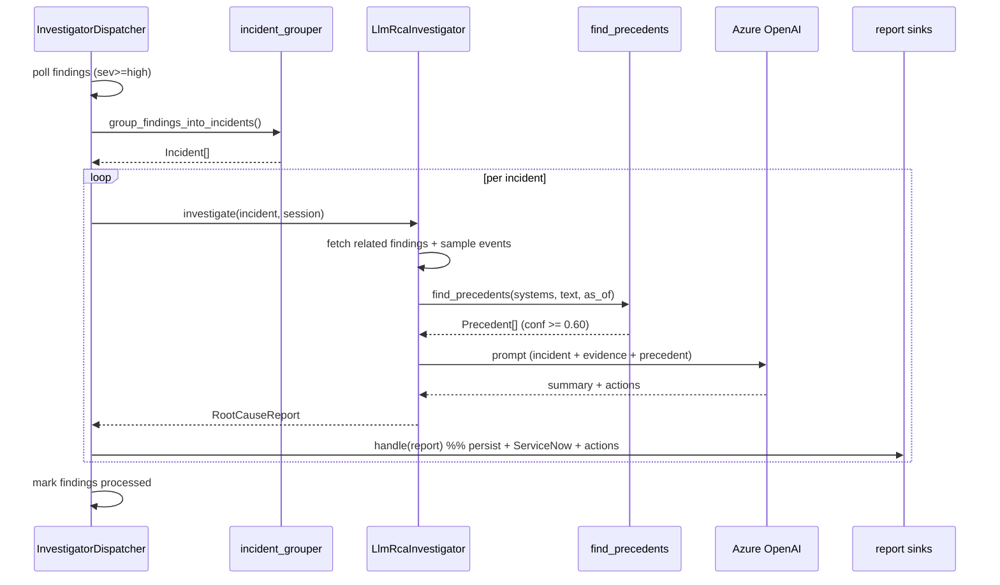
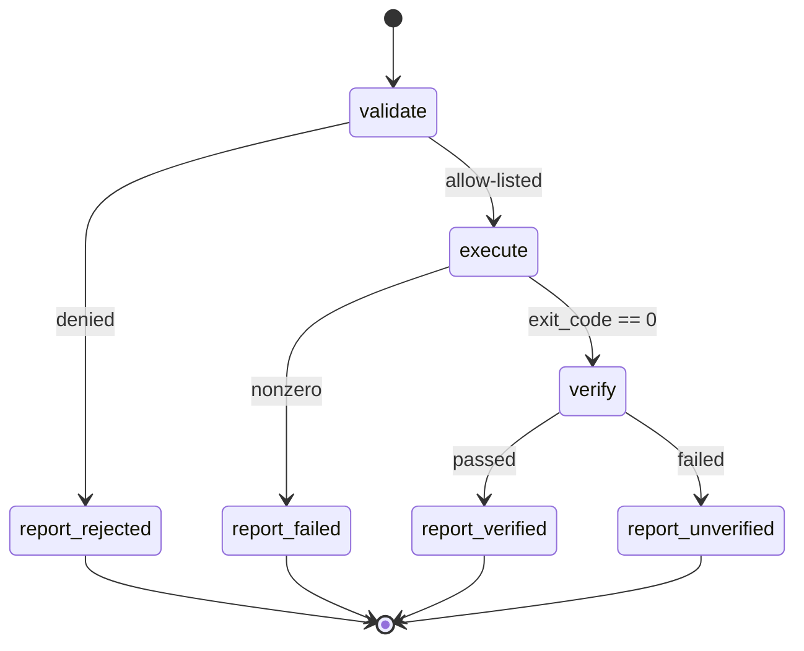

# Low-Level Design (LLD) - Process Mining Multi-Source RCA

Engineering-level design: components, data model, interfaces, sequence flows,
and the core algorithms. Pairs with the high-level view in `architecture.md`.

---

## 1. Tiered overview

| Tier | Responsibility | Entry point |
|---|---|---|
| 0 - Orchestration | Drive the cycles on a loop | `app/runner.py` |
| 1 - Ingest & Detect | Sources -> `event_log` -> `finding` | `Dispatcher` |
| 2 - Correlate & Diagnose | `finding` -> incident -> `root_cause_report` | `InvestigatorDispatcher` |
| 3 - Remediate | approved action -> execute | `RemediationDispatcher` |
| Side | ServiceNow history pull (precedent) | `scripts/sync_servicenow_history.py` |

The DB tables are the hand-off points; each tier polls unprocessed rows and
writes the next table (watermarked by `processed_at`).

---

## 2. Component catalog

### Tier 0 - Orchestration
| Component | File | Responsibility |
|---|---|---|
| `runner.run()` | `app/runner.py` | Loop: ingest -> dispatch -> investigate -> remediate; one `Registry`, shared across dispatchers |
| `Registry` | `app/orchestrator/registry.py` | Loads `modules.yaml`; resolves dotted class paths via `importlib`; builds readers/analyzers/sinks/investigators |

### Tier 1 - Ingest & Detect
| Component | File | Responsibility |
|---|---|---|
| `BaseReader` / source readers | `app/readers/*.py` | `read() -> Iterable[EventLogPayload]`; offset/state tracking; `commit()` advances state |
| `persist_events()` | `app/readers/persistence.py` | Batch insert payloads; resolve natural keys (process_definition_name + case_reference_id) -> numeric `case_id`/`process_id` |
| `Dispatcher` | `app/orchestrator/dispatcher.py` | Poll unprocessed `event_log`, group by `source_type`, run analyzer + sinks, `mark_processed` |
| `BaseAnalyzer` / analyzers | `app/analyzers/*.py` | `analyze(rows) -> list[Finding]` per source |
| `FindingsEmitterSink` | `app/sinks/findings_emitter_sink.py` | Persist `Finding`s; derive `server_ids/case_ids/time_min/max` from `contributing_rows`; dedup by `correlation_hash` |

### Tier 2 - Correlate & Diagnose
| Component | File | Responsibility |
|---|---|---|
| `group_findings_into_incidents()` | `app/orchestrator/incident_grouper.py` | Union-find clustering of findings by shared key + time |
| `InvestigatorDispatcher` | `app/orchestrator/investigator_dispatcher.py` | Poll findings (sev >= high), group, run matching investigators, route reports to sinks |
| `LlmRcaInvestigator` | `app/investigators/llm_rca_investigator.py` | Gather evidence + precedent, build prompt, call LLM, emit `RootCauseReport` |
| `find_precedents()` | `app/servicenow_history/retrieval.py` | Score & return top-k similar past incidents (confidence) |
| Report sinks | `app/sinks/report_sinks.py`, `servicenow_sink.py`, `remediation_action_sink.py` | Persist report; create ServiceNow ticket; emit `remediation_action` rows |

### Tier 3 - Remediate
| Component | File | Responsibility |
|---|---|---|
| `RemediationDispatcher` | `app/orchestrator/remediation_dispatcher.py` | Poll `approved` + `executable` actions; call `run_workflow` |
| `run_workflow()` / graph | `app/remediation/langgraph_workflow.py` | LangGraph: validate -> execute -> verify -> report |
| `allow_list`, `executor`, `verifier` | `app/remediation/*.py` | Safety gate / run / verify |

### ServiceNow history (precedent source)
| Component | File | Responsibility |
|---|---|---|
| `ServiceNowHistoryClient` | `app/servicenow_history/client.py` | GET resolved incidents (paginated, display-value, incremental) |
| `load_incidents()` | `app/servicenow_history/loader.py` | Idempotent upsert into `historical_incident` |
| sync script | `scripts/sync_servicenow_history.py` | Watermark (`MAX(sys_updated_on)`), backfill/incremental |

---

## 3. Data model (key tables)



| Table | Key columns | Notes |
|---|---|---|
| `event_log` | event_id, tenant_id, source_type, timestamp, case_id, server_id, metadata_json(JSONB), processed_at | shared raw store; indexed on (tenant, processed_at), (tenant, source_type) |
| `finding` | finding_id, source_type, severity, subject_key, payload, server_ids/case_ids(JSONB), time_min/max, correlation_hash, processed_at | tier-1 output; dedup via correlation_hash |
| `root_cause_report` | report_id, trigger_finding_id(s), severity, summary, evidence_chain, correlation_keys, payload(JSONB incl. historical_precedents), servicenow_* | tier-2 output |
| `remediation_action` | action_id, report_id, action_type(executable/advisory), command, state, exec/verify fields | tier-3 work items |
| `historical_incident` | incident_id, tenant_id, number, sys_id, short_description, description, close_notes, cmdb_ci, correlation_id, sys_updated_on, search_tsv(generated tsvector) | precedent memory; GIN index on search_tsv; unique(tenant_id, sys_id) |
| `process_definition` / `process_case` | natural-key resolution targets | lookup-or-create in persistence |

---

## 4. Interface contracts (the seams)

```python
# Reader contract
@dataclass
class EventLogPayload:  # app/readers/base.py
    tenant_id: int; source_type: str; timestamp: datetime
    case_reference_id: str | None; process_definition_name: str | None
    server_id: str | None; metadata_json: dict | None; ...
class BaseReader(ABC):
    source_type: str
    def read(self) -> Iterable[EventLogPayload]: ...
    def commit(self) -> None: ...

# Analyzer contract
@dataclass
class Finding:          # app/findings/__init__.py
    severity: str; subject_key: str; observation: str | None
    payload: dict; contributing_rows: list[EventLog]
class BaseAnalyzer(ABC):
    def analyze(self, rows: Sequence[EventLog]) -> list[Finding]: ...

# Investigator contract
class BaseInvestigator(ABC):
    name: str
    def investigate(self, incident: Incident, session: Session) -> RootCauseReport | None: ...

# Precedent (Task #19)
@dataclass
class Precedent:        # app/servicenow_history/retrieval.py
    number; sys_id; short_description; close_notes; cmdb_ci
    resolved_at; correlation_id; confidence: float   # 0..1
def find_precedents(session, tenant_id, *, correlation_id, systems,
                    category, query_text, as_of, k=3, min_confidence=0.60,
                    rerank=None) -> list[Precedent]: ...
```

---

## 5. Sequence flows

### 5.1 Tier 1 - ingest + dispatch
```mermaid
sequenceDiagram
    participant RN as runner
    participant RD as Reader
    participant PE as persist_events
    participant DP as Dispatcher
    participant AN as Analyzer
    participant FE as FindingsEmitterSink
    RN->>RD: read()
    RD-->>RN: EventLogPayload[]
    RN->>PE: persist_events(payloads)
    PE->>PE: resolve natural keys -> case_id
    PE-->>RN: event_log rows (processed_at=NULL)
    RN->>DP: run_once()
    DP->>DP: poll_unprocessed + group by source_type
    DP->>AN: analyze(rows)
    AN-->>DP: Finding[]
    DP->>FE: handle(source_type, rows, findings)
    FE->>FE: derive case_ids/server_ids; dedup hash
    FE-->>DP: finding rows
    DP->>DP: mark_processed(rows)
```

### 5.2 Tier 2 - investigate (with precedent)


### 5.3 Tier 3 - remediation (LangGraph)


---

## 6. Core algorithms

### 6.1 Incident grouping (union-find) - `incident_grouper.py`
- Build disjoint-set over findings.
- Link i,j if: same tenant AND time windows overlap (with grace) AND
  (shared server_id OR shared case_id).
- Connected components = incidents. O(n^2) over the small per-cycle batch.

### 6.2 Mule outcome classification (8 rules) - `app/mule/correlation.py`
Applied in order on events sharing a correlation_id:
1. flow.error & no preceding http.request -> `mule_internal_error`
2. http.error SocketTimeoutException -> `downstream_timeout`
3. http.error Connection/ConnectException -> `downstream_unreachable`
4. http.error HttpResponseException -> `downstream_error`
5. http.error other -> `unknown_error`
6. http.response >= 500 -> `downstream_error`
7. flow.error (fallback) -> `unknown_error`
8. else -> `success`

### 6.3 Precedent scoring (noisy-OR) - `retrieval.py`
```
confidence = 1 - PRODUCT(1 - p_signal)
  p: recurrence(correlation_id)=0.95, same cmdb_ci=0.70,
     same category=0.30, text overlap (ts_rank * TEXT_SCALE) capped 0.60
keep if confidence >= min_confidence (default 0.60)
recency (0..3) is ORDERING only (tiebreak), NOT in confidence
guard: only resolved_at <= as_of (no future fix)
```

### 6.4 Incremental sync watermark - `sync_servicenow_history.py`
- `since = MAX(sys_updated_on)` for tenant (NULL -> full backfill).
- Client query: `stateIN6,7 ^ close_notesISNOTEMPTY ^ sys_updated_on>=since`.
- Idempotent upsert (ON CONFLICT tenant_id,sys_id) -> safe re-runs.

### 6.5 Finding dedup - `findings_emitter_sink.py`
- `correlation_hash = md5(tenant|source|subject|severity|time_bucket)`.
- Skip if same hash seen within `dedup_window_minutes`.

---

## 7. Configuration (`config/modules.yaml`)
```yaml
sources:
  <source_type>:
    reader:   dotted.path.Reader
    analyzer: dotted.path.Analyzer
    sinks:    [dotted.path.Sink, ...]
    config:   { ... per-module ... }
investigators:
  llm_rca:
    class: ...LlmRcaInvestigator
    triggers: [{source_type, min_severity}, ...]
    sinks: [...]
    config: { history_enabled, history_k, history_min_confidence, servicenow_mode, ... }
remediation: { executor_mode, verifier_mode, ... }
```
Adding a source = a new entry + reader/analyzer classes. No orchestrator change.

---

## 8. Cross-cutting concerns

| Concern | Mechanism |
|---|---|
| **Idempotency** | `processed_at` watermarks; finding dedup hash; upsert on history |
| **Crash safety** | State advances only after persistence; LangGraph persists each node |
| **Multi-tenancy** | every table carries `tenant_id`; all queries scoped |
| **Fail-safe RCA** | precedent/LLM failures caught -> evidence-only report still emitted |
| **Remediation safety** | allow-list gate + human approval + verify step; mock/dry_run/real modes |
| **Determinism** | detection, correlation, scoring are rule-based; LLM only narrates |
| **Extensibility** | config-driven registry; pluggable rerank seam in retrieval |

---

## 9. Source map (where to look)
```
app/
  runner.py                      tier-0 loop
  orchestrator/                  registry, dispatcher, incident_grouper,
                                 investigator_dispatcher, remediation_dispatcher, db_reader
  readers/                       BaseReader + per-source readers + persistence
  analyzers/                     BaseAnalyzer + per-source analyzers
  mule/                          MuleIntegrationEvent + correlation (Task #14)
  investigators/                 LlmRcaInvestigator
  servicenow_history/            client, loader, retrieval (Task #19)
  remediation/                   langgraph_workflow, allow_list, executor, verifier
  sinks/                         findings emitter, report sinks, servicenow sink
  db/                            models, session, base
  ui/                            streamlit_app
```
