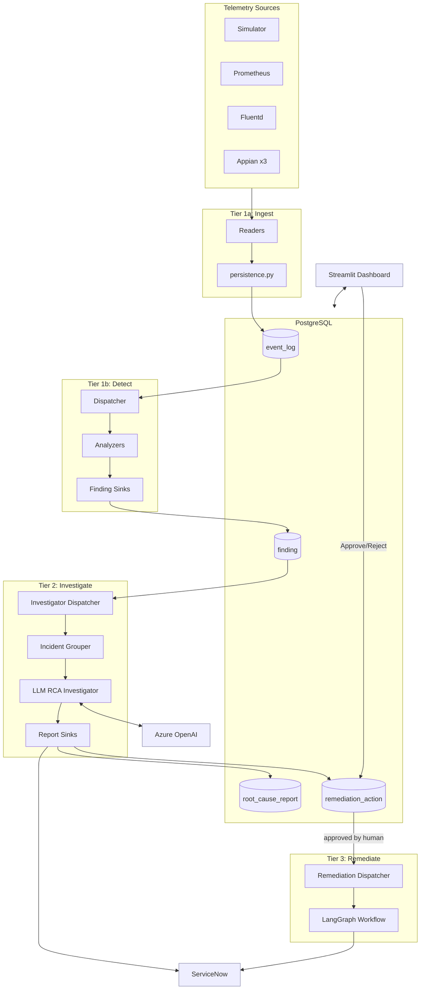
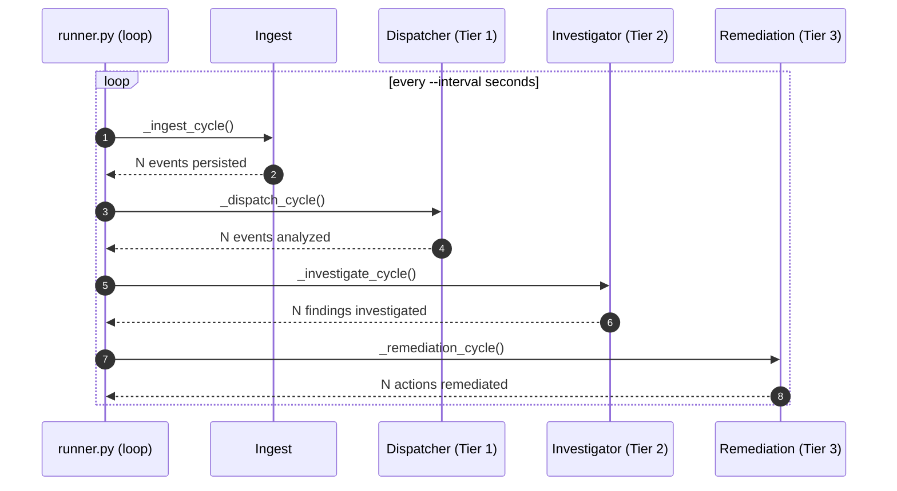
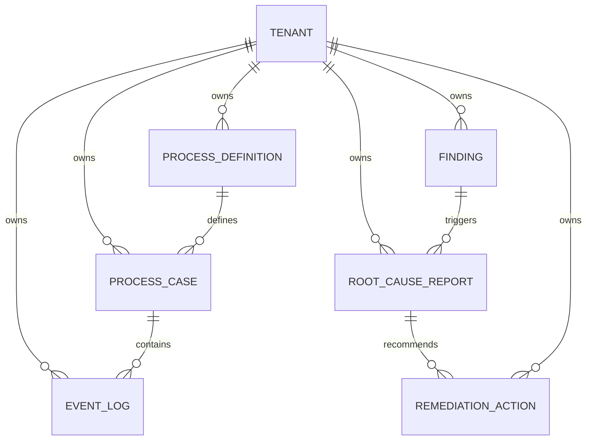
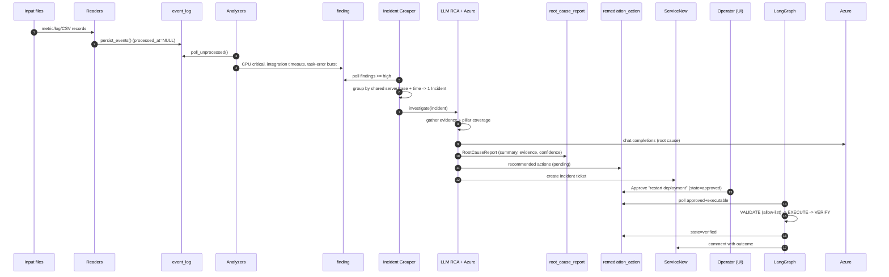
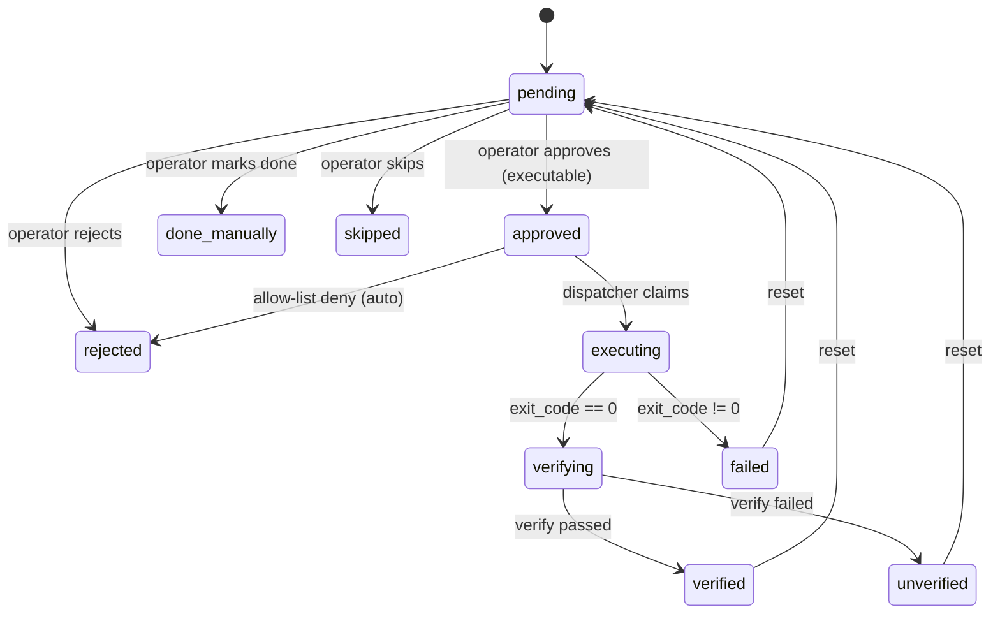

# ServerOps — Autonomous Process-Mining & Root-Cause Remediation Platform
### Technical & Architecture Documentation

---

> **Document control**
>
> | Field | Value |
> |---|---|
> | **Document title** | ServerOps — Technical & Architecture Documentation |
> | **Status** | Living document (Draft v1.0) |
> | **Audience** | Solution Architects, Platform/SRE Engineers, Engineering Managers, Product & Business Stakeholders |
> | **Owner** | dewasheesh.rana@cognizant.com |
> | **Last updated** | 2026-06-17 |
> | **Source of truth** | Generated from the `serverops` codebase (`app/`, `config/`, `alembic/`) |
> | **Related systems** | Azure OpenAI, ServiceNow, PostgreSQL |

> **How to read this document**
> - **Business / leadership** → read sections 1–3 and 9.
> - **Architects** → read sections 4–8, 10–13.
> - **Engineers / operators** → read sections 6–8, 11, 12, 14.

---

## Table of Contents

1. [Executive Summary](#1-executive-summary)
2. [Business Context & Value](#2-business-context--value)
3. [Key Concepts & Glossary](#3-key-concepts--glossary)
4. [Solution Architecture](#4-solution-architecture)
5. [The Four-Tier Processing Pipeline](#5-the-four-tier-processing-pipeline)
6. [Component Reference](#6-component-reference)
7. [Data Model](#7-data-model)
8. [End-to-End Data Flow (Worked Example)](#8-end-to-end-data-flow-worked-example)
9. [Configuration Reference](#9-configuration-reference)
10. [External Integrations](#10-external-integrations)
11. [Safety, Security & Governance](#11-safety-security--governance)
12. [Reliability & Design Principles](#12-reliability--design-principles)
13. [Deployment & Operations](#13-deployment--operations)
14. [Extensibility Guide](#14-extensibility-guide)
15. [Performance & Scaling](#15-performance--scaling)
16. [Known Limitations & Roadmap](#16-known-limitations--roadmap)
17. [Appendices](#17-appendices)

---

## 1. Executive Summary

**ServerOps** is an autonomous observability and incident-response platform. It continuously ingests operational telemetry from multiple, heterogeneous sources (infrastructure metrics, application logs, and business-process/workflow events), automatically detects anomalies, uses a Large Language Model (LLM) to determine the **cross-source root cause** of incidents, raises **ServiceNow** tickets, and — under human approval and strict safety controls — **executes and verifies remediation**.

The platform is built around a **config-driven, four-tier pipeline** that converts raw signals into governed, auditable action:

```
INGEST  →  DETECT  →  INVESTIGATE (AI)  →  REMEDIATE (human-approved)
```

**What makes it distinctive:**

- **Cross-source correlation.** Rather than alerting on isolated metrics, it groups related signals (same host/case, same time window) into a single **Incident** and reasons about them holistically.
- **LLM root-cause analysis with honest confidence.** The investigator tells the model which "data pillars" are present vs absent so it can lower confidence when coverage is partial — reducing confident-but-wrong diagnoses.
- **Safety-first automation.** Remediation defaults to a no-op "mock" mode, is gated by a command allow-list, and **never executes without explicit human approval**.
- **Pluggable by configuration.** New data sources, analyzers, and downstream actions are onboarded by editing YAML — the orchestration engine does not change.
- **Crash-safe & auditable.** Every stage communicates through database "queues"; an interrupted run resumes without data loss, and every decision and action is persisted.

---

## 2. Business Context & Value

### 2.1 The problem

Modern enterprise estates emit telemetry across three disconnected layers:

1. **End-user / desktop activity** (e.g., Soroco Scout, ActivTrak)
2. **Business process / workflow systems** (e.g., Appian, Pega, Camunda, MuleSoft)
3. **Infrastructure / application runtime** (e.g., Prometheus, Fluentd, Datadog, Splunk)

When an incident occurs, the symptoms appear in all three layers, but **the tooling is siloed**. Engineers manually stitch together CPU graphs, log errors, and stuck workflows to find the cause — slow, expensive, and error-prone. Mean-Time-To-Resolution (MTTR) suffers.

### 2.2 The solution & its value

| Business outcome | How ServerOps delivers it |
|---|---|
| **Lower MTTR** | Automatic cross-source correlation + AI root-cause narrative replaces manual log-stitching. |
| **Reduced toil** | The pipeline runs unattended; engineers act only at the approval gate. |
| **Consistent governance** | Every incident produces a ServiceNow ticket and a full, immutable audit trail. |
| **Safe automation** | Human-in-the-loop approval + allow-listed, reversible actions prevent self-inflicted outages. |
| **Vendor-neutral & future-proof** | Source-agnostic schema and config-driven onboarding avoid lock-in to any one monitoring tool. |
| **Graceful degradation** | If the LLM or ServiceNow are unavailable, the platform still produces evidence-based reports and local artifacts. |

### 2.3 Target users

- **SRE / Production Support** — review AI diagnoses and approve remediations from the dashboard.
- **Platform Architects** — onboard new telemetry sources and tune detection thresholds.
- **Service Management** — consume ServiceNow tickets with full evidence chains attached.

---

## 3. Key Concepts & Glossary

| Term | Definition |
|---|---|
| **Source type** | A category of telemetry (e.g., `prometheus`, `fluentd`, `appian_integration_trace`). The primary routing key throughout the system. |
| **Event** | A single normalized telemetry record, stored as a row in `event_log`. |
| **Finding** | A Tier-1 anomaly produced by an analyzer (e.g., "CPU sustained above threshold"). Has a severity (`normal` / `high` / `critical`). |
| **Incident** | A Tier-2 grouping of related Findings that share a correlation key (server/case) within a time window. The unit the AI reasons about. |
| **Root Cause Report (RCA)** | The AI/evidence output for an Incident: summary, confidence, evidence chain, and recommended actions. |
| **Remediation Action** | A single recommended fix derived from an RCA. Classified `executable` (runs a command) or `advisory` (manual step). |
| **Pillar** | One of three telemetry domains used to express data coverage: `pillar_1_desktop`, `pillar_2_bpm`, `pillar_3_infra`. |
| **Tenant** | A logical customer/business unit. The platform is multi-tenant; all data is scoped by `tenant_id`. |
| **Reader / Analyzer / Sink / Investigator** | The four pluggable component roles, wired via `config/modules.yaml`. |
| **Correlation hash** | A stable fingerprint used to deduplicate repeat Findings of the same incident identity. |

---

## 4. Solution Architecture

### 4.1 Architectural style

ServerOps is a **modular monolith** implemented as a single Python process (the *runner*) that executes a deterministic, staged pipeline. Components communicate **asynchronously through the database** using a queue-by-table pattern, giving the decoupling benefits of an event-driven system without the operational overhead of a message broker.

**Core principles:**

- **Configuration over code** — behavior is defined in `config/modules.yaml`, resolved at runtime by a dynamic class registry.
- **Single responsibility per component** — readers ingest, analyzers detect, investigators diagnose, sinks act.
- **Idempotent, crash-safe stages** — work is claimed from a table, processed, then marked done.
- **Human-in-the-loop for anything irreversible** — automation stops at the approval gate.

### 4.2 Logical architecture



### 4.3 Technology stack

| Layer | Technology | Role |
|---|---|---|
| Language / runtime | Python 3.12+ | Core implementation |
| Persistence | PostgreSQL 13+ (Neon or Azure DB for PostgreSQL) | System of record + inter-stage queues |
| ORM / migrations | SQLAlchemy 2.0, Alembic 1.13+ | Data access & schema versioning |
| AI / LLM | Azure OpenAI (via `openai` SDK, v1 endpoint) | Root-cause synthesis |
| Workflow engine | LangGraph | Remediation state machine |
| ITSM integration | ServiceNow REST API (via `httpx`) | Ticketing |
| UI | Streamlit + Plotly | Operator dashboard |
| Config | PyYAML | Module wiring |
| System metrics | psutil | Host metric access |
| Validation / config | Pydantic, python-dotenv | Data shapes & secrets |

---

## 5. The Four-Tier Processing Pipeline

The entire system is driven by one loop in **`app/runner.py`**, which executes four stages per cycle. Each stage is independently restartable and communicates only via the database.



| Tier | Stage | Input (table) | Output (table) | Driver |
|---|---|---|---|---|
| **1a** | Ingest | files on disk | `event_log` (`processed_at=NULL`) | `_ingest_cycle` |
| **1b** | Detect | `event_log` (unprocessed) | `finding` (`processed_at=NULL`) | `Dispatcher` |
| **2** | Investigate | `finding` (unprocessed, ≥high) | `root_cause_report`, `remediation_action` (`pending`) + ServiceNow ticket | `InvestigatorDispatcher` |
| **3** | Remediate | `remediation_action` (`approved`, `executable`) | `remediation_action` (`verified`/`failed`/…) | `RemediationDispatcher` |

> **The queue-by-table contract:** each stage writes rows in an "unclaimed" state (`processed_at IS NULL` or `state = 'pending'`). The next stage polls for them, does its work, then marks them claimed. A crash mid-stage simply leaves the rows unclaimed for the next cycle — **no data loss, no duplicate side effects** (subject to dedup logic).

---

## 6. Component Reference

Organized by package. Each subsection lists the component's responsibility and key classes/functions.

### 6.1 Entry points & orchestration (`app/`, `app/orchestrator/`)

| File | Responsibility | Key elements |
|---|---|---|
| `runner.py` | Single-process driver loop; runs the 4 stages every interval. | `run()`, `_ingest_cycle`, `_dispatch_cycle`, `_investigate_cycle`, `_remediation_cycle`; signal handling for graceful shutdown. |
| `orchestrator/registry.py` | Parses `modules.yaml`; dynamically imports and instantiates readers/analyzers/sinks/investigators. | `Registry.load()`, `build_reader/build_analyzer/build_sinks`, `investigators()`; `ModuleEntry`, `TriggerSpec`, `InvestigatorEntry`. |
| `orchestrator/dispatcher.py` | Tier-1b: polls events, groups by source, runs analyzer + sinks. | `Dispatcher.run_once()`, `_handle_group()`. |
| `orchestrator/db_reader.py` | Claims/releases `event_log` rows. | `poll_unprocessed()`, `mark_processed()`. |
| `orchestrator/findings_reader.py` | Claims/releases `finding` rows above a severity threshold. | `poll_unprocessed_findings()`, `mark_findings_processed()`. |
| `orchestrator/investigator_dispatcher.py` | Tier-2: polls findings, groups into incidents, runs matching investigators + sinks. | `InvestigatorDispatcher.run_once()`, `_matching_investigators()`, `_run_investigator()`. |
| `orchestrator/incident_grouper.py` | Groups findings into `Incident`s via union-find on shared correlation keys + time overlap. | `group_findings_into_incidents()`, `Incident` (with `primary_finding`, `all_server_ids`, `all_case_ids`, `time_min/max`). |
| `orchestrator/remediation_dispatcher.py` | Tier-3: picks up approved executable actions, runs the LangGraph workflow. | `RemediationDispatcher.run_once()`. |

### 6.2 Ingestion (`app/readers/`)

| File | Responsibility |
|---|---|
| `base.py` | `BaseReader` abstract class + the canonical `EventLogPayload` dataclass (the normalized event shape). |
| `simulator_file_reader.py` | Reads simulator JSONL (new file per tick; tracks processed filenames). |
| `prometheus_reader.py` | Reads Prometheus node-metric JSON snapshots; flattens nested shape to the common metric schema. |
| `fluentd_reader.py` | Reads Fluentd JSONL logs; tracks byte offset for append-tailing. |
| `appian_csv_reader.py` | Shared base for Appian CSV logs; byte-offset tailing + header handling. |
| `appian_process_metrics_reader.py` | Appian aggregate process gauges (`process.csv`). |
| `appian_integration_trace_reader.py` | Appian integration calls (`integration_trace.csv`); carries Process ID (case) + Username (actor). |
| `appian_task_errors_reader.py` | Appian task-access errors (`task_errors.csv`). |
| `persistence.py` | Converts `EventLogPayload`s to `event_log` rows; resolves natural keys to `process_definition` / `process_case` FKs (lookup-or-create). `persist_events()`. |
| `reader_state.py` | Per-source ingestion bookmarks in `data/state/<source>.json`. |
| `timestamps.py` | Tolerant ISO-8601 / epoch timestamp parsing. |

### 6.3 Detection (`app/analyzers/`, `app/findings/`)

| File | Responsibility |
|---|---|
| `analyzers/base.py` | `BaseAnalyzer` abstract class: `analyze(rows) -> list[Finding]`. |
| `analyzers/prometheus_metrics_analyzer.py` | Sustained-high / peak / spike / trend detection on CPU, memory, connections, slow queries. Reused for the `simulator` source. |
| `analyzers/fluentd_severity_analyzer.py` | Per-host ERROR/WARN counting and severity classification. |
| `analyzers/appian_process_metrics_analyzer.py` | Spike / sustained / trend on `paused_by_exception` process & node gauges. |
| `analyzers/appian_integration_analyzer.py` | Per-integration timeout / failure-rate / slow-call detection. |
| `analyzers/appian_task_errors_analyzer.py` | Per-user and cross-user task-error burst detection. |
| `findings/__init__.py` | The `Finding` and `RootCauseReport` dataclasses (the contracts between tiers). |

### 6.4 Investigation (`app/investigators/`, `app/pillars.py`, `app/utils/`)

| File | Responsibility |
|---|---|
| `investigators/base.py` | `BaseInvestigator` abstract class: `investigate(incident, session) -> RootCauseReport`. |
| `investigators/llm_rca_investigator.py` | The general-purpose AI investigator. Gathers evidence, computes pillar coverage, prompts Azure OpenAI, assembles the RCA; falls back to evidence-only if the LLM is unavailable. |
| `pillars.py` | Maps each source type to a telemetry pillar; computes present/absent pillars for coverage honesty. |
| `utils/llm_handler.py` | Strips markdown fences from LLM JSON output. |

### 6.5 Action / output (`app/sinks/`, `app/integrations/`)

| File | Tier | Side effect |
|---|---|---|
| `sinks/base.py` | — | `BaseSink` interface: `handle(source_type, rows, result, analyzer_class)`. |
| `sinks/console_sink.py` | 1 | Pretty-prints findings to stdout. |
| `sinks/findings_emitter_sink.py` | 1 | **Writes `finding` rows** (with correlation keys + dedup). |
| `sinks/report_sinks.py` | 2 | `ConsoleReportSink` prints; `RootCauseReportEmitterSink` **writes `root_cause_report`** and stamps `report_id`. |
| `sinks/remediation_action_sink.py` | 2 | **Writes `remediation_action` rows** from the RCA's recommended actions. |
| `sinks/servicenow_sink.py` | 2 | **Creates/updates ServiceNow incidents** with recurrence detection; back-links ticket id to the report. |
| `integrations/servicenow_client.py` | — | Low-level ServiceNow REST helper (`post_comment()`). |

### 6.6 Remediation (`app/remediation/`)

| File | Responsibility |
|---|---|
| `langgraph_workflow.py` | The `VALIDATE → EXECUTE → VERIFY → REPORT` state machine; persists state at each node; posts ServiceNow comments. |
| `allow_list.py` | Two-layer command gate: hard-coded **forbidden** patterns + strict **allowed** (restart-only) patterns. `evaluate_command()`. |
| `executor.py` | Command execution strategies: `MockExecutor`, `DryRunExecutor`, `RealExecutor` (real requires `confirm_real: true`). |
| `verifier.py` | Post-fix verification: `ConfidenceDrivenMockVerifier`, `AlwaysPassVerifier`. |
| `decisions.py` | Applies operator UI decisions (Approve/Reject/Done/Skip/Reset) to `remediation_action` state; posts ServiceNow comments. |

### 6.7 Persistence & UI (`app/db/`, `app/ui/`)

| File | Responsibility |
|---|---|
| `db/base.py` | SQLAlchemy `DeclarativeBase`. |
| `db/models.py` | All ORM models (see §7). |
| `db/session.py` | Engine + `SessionLocal` from `DATABASE_URL` (with `postgres://` → `postgresql://` normalization, `pool_pre_ping`). |
| `ui/streamlit_app.py` | Operator dashboard: Overview, Root-Cause Reports, Pending Approvals, Findings, Events Explorer, Cases; approval buttons → `decisions.py`. |

### 6.8 Tooling (`app/`)

| File | Responsibility |
|---|---|
| `data_simulator.py` | Generates synthetic `simulator`-source telemetry (`normal`/`spike`/`problem` scenarios). |
| `smoke_test.py` | Single-process end-to-end validation of ingest + dispatch. |
| `dev_reset.py` | Truncates operational tables + reader state for a clean test run (keeps tenant + schema). |
| `paths.py` | Project path constants and `resolve_under_project()`. |

---

## 7. Data Model

### 7.1 Entity-relationship overview



### 7.2 Table specifications

**`tenant`** — logical customer/business unit (multi-tenancy root).
Key columns: `tenant_id` (PK), `tenant_name` (unique), `industry`, `region`, `status`, `created_at`.

**`process_definition`** — a named business process/workflow template.
Key columns: `process_id` (PK), `tenant_id` (FK), `process_name`, `process_version`, `is_active`.

**`process_case`** — a single instance/run of a process (e.g., one Appian process instance).
Key columns: `case_id` (PK), `process_id` (FK), `tenant_id` (FK), `case_reference_id`, `start_time`, `end_time`, `status`, `case_metadata_json` (JSONB).

**`event_log`** — the universal normalized event store (all sources land here).
Key columns: `event_id` (PK), `tenant_id`/`case_id`/`process_id` (FK), `source_type`, `activity_name`, `activity_type`, `timestamp`, `lifecycle_stage`, `actor_id`, `system_id`, `server_id`, `duration`, `metadata_json` (JSONB), `processed_at`, `created_at`.
Indexes: `(tenant_id, processed_at)`, `(tenant_id, source_type)`, `timestamp`, `case_id`.

**`finding`** — Tier-1 anomalies.
Key columns: `finding_id` (PK), `tenant_id` (FK), `source_type`, `analyzer_class`, `severity`, `subject_key`, `observation`, `payload` (JSONB), correlation keys (`server_ids`, `case_ids`, `actor_ids`, `contributing_event_ids` as JSONB), `time_min`/`time_max`, `correlation_hash`, `produced_at`, `processed_at`.
Indexes: `(tenant_id, processed_at)`, `(tenant_id, severity, produced_at)`, `(correlation_hash, produced_at)`, `source_type`.

**`root_cause_report`** — Tier-2 RCA output.
Key columns: `report_id` (PK), `tenant_id` (FK), `investigator_class`, `trigger_finding_id` (FK), `trigger_finding_ids` (JSONB), `severity`, `summary`, `evidence_chain` (JSONB), `related_event_ids`/`related_finding_ids` (JSONB), `correlation_keys` (JSONB), `payload` (JSONB), `produced_at`, `servicenow_number`/`servicenow_sys_id`/`servicenow_url`.

**`remediation_action`** — Tier-3 recommended/executed fixes.
Key columns: `action_id` (PK), `tenant_id` (FK), `report_id` (FK), `sequence_number`, `action_text`, `state`, `action_type` (`executable`/`advisory`), `command`, `manual_steps`, `approver_id`, `decided_at`, `decision_note`, `executed_at`, `execution_output`, `exit_code`, `verified_at`, `verify_result`, `created_at`.
Indexes: `report_id`, `(tenant_id, state)`.

### 7.3 Schema evolution (Alembic migrations)

| Revision | Purpose |
|---|---|
| `0001_initial_schema` | tenant, process_definition, process_case, event_log |
| `0002_natural_key_uniqueness` | Uniqueness for lookup-or-create of definitions/cases |
| `0003_finding_table` | Tier-1 findings |
| `0004_root_cause_report` | Tier-2 RCA reports |
| `0005_report_multi_trigger` | Multi-finding incidents (`trigger_finding_ids`) |
| `0006_root_cause_report_servicenow_backlink` | ServiceNow ticket back-links |
| `0007_remediation_action` | Tier-3 action rows |
| `0008_remediation_execution` | Execution outcome columns |
| `0009_action_classification` | `executable` vs `advisory` classification |

---

## 8. End-to-End Data Flow (Worked Example)

**Scenario:** CPU saturates on `appian-webapp-03`, causing integration timeouts and a burst of user task errors.



**Step-by-step with table state:**

1. **Ingest.** `appian_*` and `prometheus` readers parse their files; `persist_events()` inserts rows into `event_log` (`processed_at=NULL`).
2. **Detect.** `Dispatcher` polls events, groups by source. `PrometheusMetricsAnalyzer` emits a `critical` Finding ("Sustained high CPU"); `AppianIntegrationAnalyzer` emits `critical` ("3 timeouts on `_a-int-creditCheck-0001`"); `AppianTaskErrorsAnalyzer` emits `critical` ("8 task errors"). `FindingsEmitterSink` writes three rows to `finding` with overlapping `server_ids`/`case_ids`.
3. **Group.** `InvestigatorDispatcher` polls findings ≥ high. `incident_grouper` sees they share `appian-webapp-03` (and time window) → **one Incident**.
4. **Investigate.** `LlmRcaInvestigator` fetches related findings + sample events, computes pillar coverage (infra + BPM present, desktop absent → confidence tempered), prompts Azure OpenAI, and produces a `RootCauseReport`.
5. **Persist & act.** `RootCauseReportEmitterSink` writes `root_cause_report`; `RemediationActionEmitterSink` writes `remediation_action` rows (`pending`); `ServiceNowReportSink` opens a ticket and back-links its number.
6. **Approve.** An operator reviews the RCA in Streamlit and clicks **Approve** on the executable action → `decisions.py` sets `state=approved`.
7. **Remediate.** `RemediationDispatcher` picks it up; the LangGraph workflow runs `VALIDATE` (allow-list pass) → `EXECUTE` (mock/real) → `VERIFY` → `REPORT`, updating the row to `verified` and commenting on the ServiceNow ticket.

---

## 9. Configuration Reference

All wiring lives in **`config/modules.yaml`**. The orchestrator reads it at startup; no code changes are needed to reconfigure routing.

### 9.1 `sources` block (Tier-1)

Each source type declares the classes that handle it:

```yaml
sources:
  fluentd:
    reader:   app.readers.fluentd_reader.FluentdReader
    analyzer: app.analyzers.fluentd_severity_analyzer.FluentdSeverityAnalyzer
    sinks:
      - app.sinks.console_sink.ConsoleSink
      - app.sinks.findings_emitter_sink.FindingsEmitterSink
    config:
      input_dir: data/input/fluentd
      file_glob: "*.jsonl"
```

| Key | Meaning |
|---|---|
| `reader` | Class that ingests this source into `event_log`. |
| `analyzer` | Class that turns its events into Findings. |
| `sinks` | Ordered list of classes that consume the analyzer result. |
| `config` | Free-form per-module settings passed to all three. |

### 9.2 `investigators` block (Tier-2)

```yaml
investigators:
  llm_rca:
    class: app.investigators.llm_rca_investigator.LlmRcaInvestigator
    triggers:
      - { source_type: appian_integration_trace, min_severity: high }
      - { source_type: prometheus,               min_severity: critical }
    sinks:
      - app.sinks.report_sinks.ConsoleReportSink
      - app.sinks.report_sinks.RootCauseReportEmitterSink
      - app.sinks.remediation_action_sink.RemediationActionEmitterSink
      - app.sinks.servicenow_sink.ServiceNowReportSink
    config:
      window_minutes_before: 5
      window_minutes_after: 1
      max_related_findings: 20
      llm_temperature: 0.2
```

`triggers` define which (source_type, min_severity) Findings activate the investigator. `sinks` define the report-handling chain (note **order matters** — the report emitter must run before the action and ServiceNow sinks so `report_id` is available).

### 9.3 `remediation` block (Tier-3)

```yaml
remediation:
  executor_mode: mock                # mock | dry_run | real
  verifier_mode: confidence_driven   # confidence_driven | always_pass
  verify_confidence_threshold: 0.7
  mock_failure_rate: 0.0
  real_timeout_sec: 60
  # confirm_real: true               # REQUIRED to enable real execution
```

---

## 10. External Integrations

### 10.1 PostgreSQL (required)

System of record and inter-stage queue. Configured via `DATABASE_URL`. Works with any Postgres 13+ (Neon managed Postgres, Azure Database for PostgreSQL Flexible Server, or local). `session.py` adds `pool_pre_ping` and normalizes legacy `postgres://` URLs.

### 10.2 Azure OpenAI (required for AI RCA)

Used **only** by `LlmRcaInvestigator`. The code constructs a standard `openai.OpenAI` client with `base_url = AZURE_OPENAI_ENDPOINT` (the v1 surface, ending `/openai/v1`) and calls `chat.completions.create(model=AZURE_OPENAI_DEPLOYMENT, …)`.

**Provisioning footprint:** one Azure OpenAI resource + **one chat-model deployment** (e.g., `gpt-4o` / `gpt-4.1-mini`). Embedding deployments are **not** used by the current code.

**Required env:** `AZURE_OPENAI_API_KEY`, `AZURE_OPENAI_ENDPOINT`, `AZURE_OPENAI_DEPLOYMENT`, `AZURE_OPENAI_API_VERSION`.

**Degradation:** if any are missing, the investigator emits an **evidence-only** report (`llm_status = fallback`) — the pipeline continues to produce findings, reports, and tickets.

### 10.3 ServiceNow (optional)

`ServiceNowReportSink` + `servicenow_client.py` create/update incidents. Modes:

- `real` — POST/PATCH to the ServiceNow REST API (needs `SERVICENOW_*` env vars).
- `mock` — write JSON to `data/output/servicenow_mock/`.
- `dry_run` — log payloads only.

It is **state-aware**: recurrences of the same incident identity comment on the existing open ticket (states 1/2/3) rather than creating duplicates. Default mode = `real` if credentials present, else `mock`.

---

## 11. Safety, Security & Governance

Remediation is the highest-risk capability; the design applies defense-in-depth:

| Control | Mechanism |
|---|---|
| **Human-in-the-loop** | Nothing executes until an operator sets `state = approved` via the UI (`decisions.py`). |
| **Safe by default** | `executor_mode` defaults to `mock` (no real side effects). `real` requires **both** `executor_mode: real` **and** `confirm_real: true`. |
| **Command allow-list** | `allow_list.py` enforces a hard **forbidden** set (`rm -rf`, `DROP TABLE`, `TRUNCATE`, `mkfs`, `dd if=`, fork bombs, `shutdown`) and a strict **allowed** set (restart-only: `kubectl rollout restart`, `systemctl restart`, `docker restart`, bounded `kubectl scale`). Anything else is auto-rejected. |
| **Reversible actions only** | V1 allowed actions are restart/scale operations — recoverable, not destructive. |
| **State locking** | Actions in `executing`/`verifying` cannot be altered by the UI; terminal states require explicit reset. |
| **Full audit trail** | Every decision, command, exit code, output, and verification result is persisted on `remediation_action`; ServiceNow journal comments mirror each transition. |
| **Secret hygiene** | Credentials are read from environment/`.env` (gitignored); no secrets in code or config. |
| **Multi-tenant isolation** | Every query is scoped by `tenant_id`; cross-tenant correlation is structurally prevented in `incident_grouper`. |

### 11.1 Remediation state machine



---

## 12. Reliability & Design Principles

| Principle | Implementation |
|---|---|
| **Crash safety** | Work is marked processed only *after* successful handling; an interrupted cycle re-processes unclaimed rows. |
| **Idempotency / dedup** | `FindingsEmitterSink` deduplicates by `correlation_hash` within a window; ServiceNow sink avoids duplicate tickets via correlation id + open-state detection. |
| **Loose coupling** | Stages share no in-memory state — only database tables. Any stage can be scaled, replaced, or restarted independently. |
| **Graceful degradation** | LLM and ServiceNow failures fall back to evidence-only reports and local artifacts. |
| **Configuration-driven extensibility** | New sources/investigators added via YAML + classes; the orchestrator is closed for modification, open for extension. |
| **Observability** | Structured logging at each stage; the console sinks and Streamlit dashboard provide live visibility. |
| **Multi-tenancy** | First-class `tenant_id` scoping across all tables and queries. |

---

## 13. Deployment & Operations

### 13.1 Prerequisites

- Python 3.12+ (3.13 supported)
- A reachable PostgreSQL 13+ instance (`DATABASE_URL`)
- (Optional) Azure OpenAI resource + chat deployment
- (Optional) ServiceNow instance / PDI

### 13.2 First-time setup

```powershell
# 1. Virtual environment
python -m venv .venv
.\.venv\Scripts\Activate.ps1

# 2. Dependencies
pip install -r requirements.txt

# 3. Configure secrets
Copy-Item .env.example .env   # then edit DATABASE_URL (+ Azure/ServiceNow if used)

# 4. Create schema (also seeds tenant_id=1)
alembic upgrade head

# 5. Validate end-to-end
python app/smoke_test.py
```

### 13.3 Running the platform

Run in three terminals (each with the venv activated):

```powershell
# Terminal 1 — generate telemetry
python app/data_simulator.py --scenario=problem --interval=30

# Terminal 2 — the pipeline engine
python app/runner.py --interval 5

# Terminal 3 — the operator dashboard
streamlit run app/ui/streamlit_app.py
```

`runner.py` flags: `--config`, `--tenant`, `--interval`, `--duration`.

### 13.4 Operational runbook

| Task | Command / action |
|---|---|
| Reset to clean state | `python app/dev_reset.py` (keeps schema + tenant) |
| Reset but keep RCA history | `python app/dev_reset.py --keep-reports` |
| Apply a new migration | `alembic upgrade head` |
| Enable real remediation | Set `executor_mode: real` **and** `confirm_real: true` in `modules.yaml`; ensure allow-listed commands + credentials. |
| Disable AI temporarily | Unset Azure env vars → automatic evidence-only fallback. |

### 13.5 Common failure modes

| Symptom | Likely cause | Resolution |
|---|---|---|
| `alembic upgrade` fails | Bad `DATABASE_URL` / DB unreachable | Verify connection string, SSL params, server up. |
| Reports show `llm_status: fallback` | Azure env not set / endpoint missing `/openai/v1` | Fix `AZURE_OPENAI_*`; confirm deployment name. |
| Tickets written as local JSON | ServiceNow creds absent → mock mode | Set `SERVICENOW_*` for real mode. |
| No findings produced | Telemetry below thresholds, or no input files | Use `--scenario=problem`; confirm `data/input/`. |

---

## 14. Extensibility Guide

### 14.1 Onboard a new telemetry source

1. **Write a reader** extending `BaseReader`; emit `EventLogPayload`s; track ingestion state.
2. **Write an analyzer** extending `BaseAnalyzer`; return `Finding`s (set `contributing_rows`).
3. **Register in `modules.yaml`** under `sources:` with reader/analyzer/sinks/config.
4. **(Optional) Map the pillar** in `pillars.py` for coverage honesty.
5. **(Optional) Add an investigator trigger** for the new source.

No orchestrator code changes are required.

### 14.2 Add a new investigator

Extend `BaseInvestigator`, implement `investigate(incident, session)`, register under `investigators:` with `triggers` and a `sinks` chain.

### 14.3 Add a new downstream action

Implement `BaseSink.handle(...)` and add it to the relevant `sinks` list. Tier-2 sinks that depend on `report_id` must run after `RootCauseReportEmitterSink`.

---

## 15. Performance & Scaling

- **Batching.** Tier-1 polls up to 500 events/cycle; Tier-2 up to 100 findings/cycle (tunable).
- **Indexing.** Hot paths (`processed_at`, `severity`, `correlation_hash`, `source_type`, time) are indexed on `event_log` and `finding`.
- **LLM cost control.** Evidence is trimmed (drop verbose metadata, cap sample events per source, cap related findings) before prompting; one LLM call per incident, not per finding.
- **Throughput knobs.** `--interval` (cycle frequency), batch sizes, and per-source `poll_interval_sec`.
- **Scale-out path.** Because stages communicate via DB queues, Tier-1/2/3 can be split into separate processes; tenant sharding is natural via `tenant_id` partitioning.

> **Current constraint:** the runner is single-process and single-threaded per cycle. Horizontal scaling would require claim-locking (`SELECT … FOR UPDATE SKIP LOCKED`) to allow concurrent workers — a roadmap item.

---

## 16. Known Limitations & Roadmap

| Area | Current state | Opportunity |
|---|---|---|
| Telemetry sources | 6 wired (simulator, prometheus, fluentd, 3× appian); several still fed by **static files** | **Build per-source simulators** to replace static files with live, correlated data (designed, pending). |
| Concurrency | Single-process runner | Multi-worker with row-level claim locking. |
| Real remediation | Restart-only allow-list, mock by default | Expand reversible action catalog; add rollback hooks. |
| Verification | Confidence-driven mock (V1) | Real metric re-poll post-remediation (V2). |
| RAG / embeddings | Env placeholder, unused | Policy/runbook retrieval to ground RCA. |
| Pillar 1 (desktop) | Mapped but no readers | Onboard desktop-activity sources. |
| Tests | `smoke_test.py` only | Unit + integration test suite, CI. |
| Auth on UI | None | Add SSO/RBAC to the Streamlit dashboard. |

---

## 17. Appendices

### 17.1 Environment variables

| Variable | Required | Purpose |
|---|---|---|
| `DATABASE_URL` | Yes | PostgreSQL connection string. |
| `AZURE_OPENAI_API_KEY` | For AI | Azure OpenAI key. |
| `AZURE_OPENAI_ENDPOINT` | For AI | Endpoint, must end `/openai/v1`. |
| `AZURE_OPENAI_DEPLOYMENT` | For AI | Chat deployment name. |
| `AZURE_OPENAI_API_VERSION` | For AI | e.g., `2024-12-01-preview`. |
| `AZURE_TEXT_EMBEDDING_API_KEY` | No | Reserved; unused. |
| `SERVICENOW_INSTANCE_URL` | For ITSM | ServiceNow base URL. |
| `SERVICENOW_USERNAME` / `SERVICENOW_PASSWORD` | For ITSM | ServiceNow credentials. |

### 17.2 Severity & detection matrix (representative)

| Source | Critical | High |
|---|---|---|
| prometheus / simulator | Peak CPU/mem > 90, or sustained run ≥3 readings > 78 | Increasing trend > 70, transient spike > 85, slow queries > 10 |
| fluentd | ≥5 ERROR per host | ≥1 ERROR, or ≥5 WARN |
| appian_integration_trace | ≥3 timeouts on one integration | failure rate ≥25%, or ≥5 slow calls |
| appian_process_metrics | `paused_by_exception` spike (≥3× & ≥10) or sustained >20 | monotonic increase > 10 |
| appian_task_errors | ≥8 errors per batch | per-user ≥2 errors |

### 17.3 Pillar mapping

| Pillar | Domain | Example sources |
|---|---|---|
| `pillar_1_desktop` | User/desktop activity | soroco_scout, activtrak, ms_activity_insights |
| `pillar_2_bpm` | Business process / integration | appian_*, mule, pega, camunda, workato |
| `pillar_3_infra` | Infrastructure / runtime | prometheus, fluentd, datadog, splunk, simulator |

### 17.4 Repository layout

```
serverops/
├── app/
│   ├── runner.py              # main loop (4 stages)
│   ├── data_simulator.py      # synthetic telemetry
│   ├── smoke_test.py          # end-to-end check
│   ├── dev_reset.py           # clean state
│   ├── paths.py / pillars.py
│   ├── db/                    # base, models, session
│   ├── readers/               # ingestion + persistence + state
│   ├── analyzers/             # Tier-1 detection
│   ├── findings/              # Finding / RootCauseReport dataclasses
│   ├── orchestrator/          # registry, dispatchers, db/findings readers, grouper
│   ├── investigators/         # Tier-2 LLM RCA
│   ├── sinks/                 # outputs: findings, reports, actions, ServiceNow, console
│   ├── integrations/          # ServiceNow client
│   ├── remediation/           # LangGraph workflow, allow-list, executor, verifier, decisions
│   ├── ui/                    # Streamlit dashboard
│   └── utils/                 # llm_handler
├── config/                    # modules.yaml, action_policy.yaml, settings
├── alembic/                   # migrations 0001–0009
├── data/                      # input / state / output
├── requirements.txt
└── .env.example
```

---

*End of document.*
