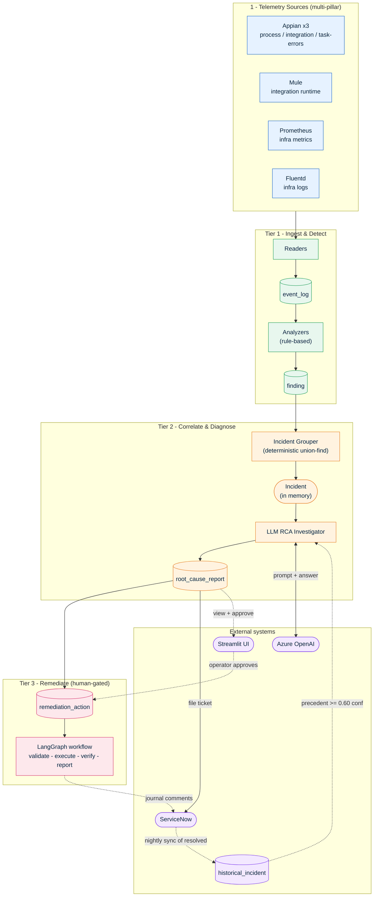
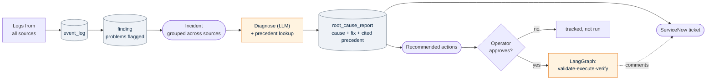
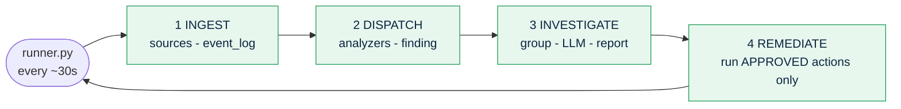

# Architecture Diagrams — Process Mining RCA Platform

Rendered Mermaid diagrams. View in VS Code (Markdown Preview / Mermaid plugin),
on GitHub, or paste into https://mermaid.live to export a high-res PNG/SVG for
the slide deck.

---

## 1. Platform architecture (the big picture)

---

## 2. End-to-end flow (what happens per incident)

---

## 3. The runner loop (production = always-on)

---

## How to export for the slide deck
- **VS Code:** open this file, use the Markdown/Mermaid preview, right-click the
  diagram -> copy/export image.
- **mermaid.live:** paste a diagram block, then "Actions -> PNG/SVG" (high-res).
- Drop the exported PNG onto the "Architecture" slide in `DEMO_DECK.md`.
